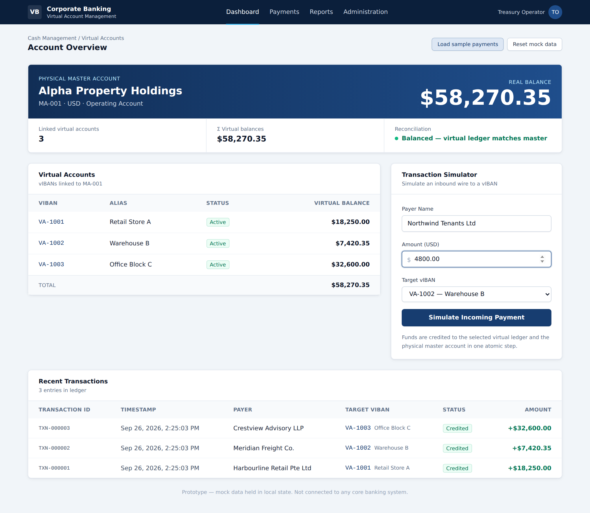
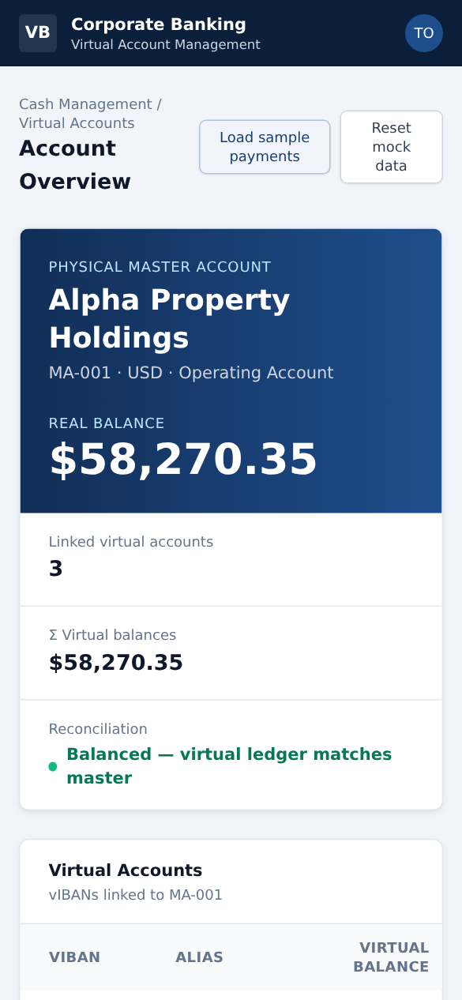

# Virtual Account Management (VAM) — Prototype

A single-page prototype of a corporate banking **Virtual Account Management** dashboard, built with React + Vite + Tailwind CSS. All data lives in local React state (a `useReducer` store) that stands in for a database.

**Live demo:** https://perpetualxbeta-ai.github.io/vam-dashboard/ — click **Load sample payments** to populate it, or post your own payments in the simulator.



<details>
<summary>Mobile view</summary>


</details>

## Run it

```bash
npm install
npm run dev      # http://localhost:5173
npm run build    # production build in dist/
```

## Architecture

See [docs/ARCHITECTURE.md](docs/ARCHITECTURE.md) for diagrams of the master/vIBAN concept, the component structure, the data model, the payment routing sequence, the validation logic, the deployment pipeline and an illustrative production target state.

## Testing

See [docs/TEST_PLAN.md](docs/TEST_PLAN.md) for the test plan: requirements traceability, 50+ test cases across validation, routing, reconciliation, UI and deployment, known defects, and the automation roadmap.

## Deployment

Every push to `main` builds the app and publishes it to GitHub Pages via `.github/workflows/deploy.yml`. One-time setup: in the repo, go to **Settings → Pages** and set **Source** to **GitHub Actions**.

## What it does

- **Master account header**: Alpha Property Holdings (`MA-001`, USD) with its real balance, the sum of virtual balances and a live reconciliation indicator.
- **Virtual accounts table**: `VA-1001` Retail Store A, `VA-1002` Warehouse B, `VA-1003` Office Block C, with balances and a total row.
- **Transaction simulator**: payer name, amount and target vIBAN; "Simulate Incoming Payment" routes the wire.
- **Recent transactions**: the ledger, newest first.
- **Load sample payments / Reset mock data**: populate the dashboard with three example wires, or return every balance to zero.

## Routing logic (`src/state/vamStore.js`)

1. **Validate**: payer, a positive amount and an active target vIBAN are required.
2. **Credit virtual ledger**: add the amount to the target vIBAN's `virtualBalance`.
3. **Credit master account**: add the same amount to `realBalance`.
4. **Log**: prepend `{ id, timestamp, payerName, amount, targetVIban, status }` to the ledger.

Steps 2–4 happen in one reducer transition, so the UI never sees a half-applied payment. Balances are stored as **integer cents**, so `Σ virtualBalance === realBalance` holds exactly (no floating-point drift such as 0.1 + 0.2). The reducer also checks this invariant before committing and rolls back if it would break.
