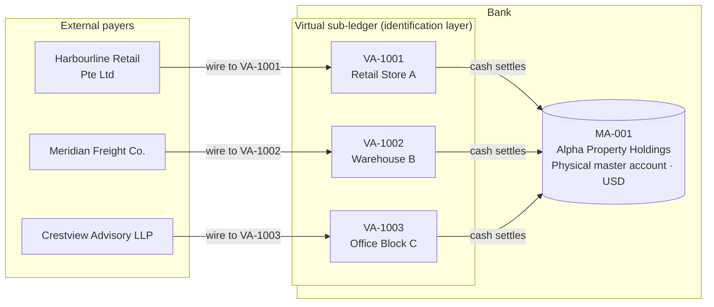
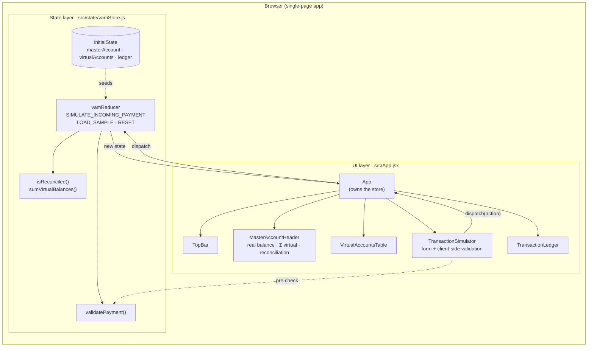
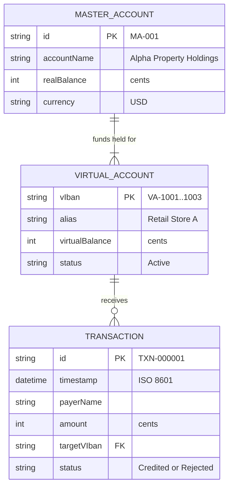
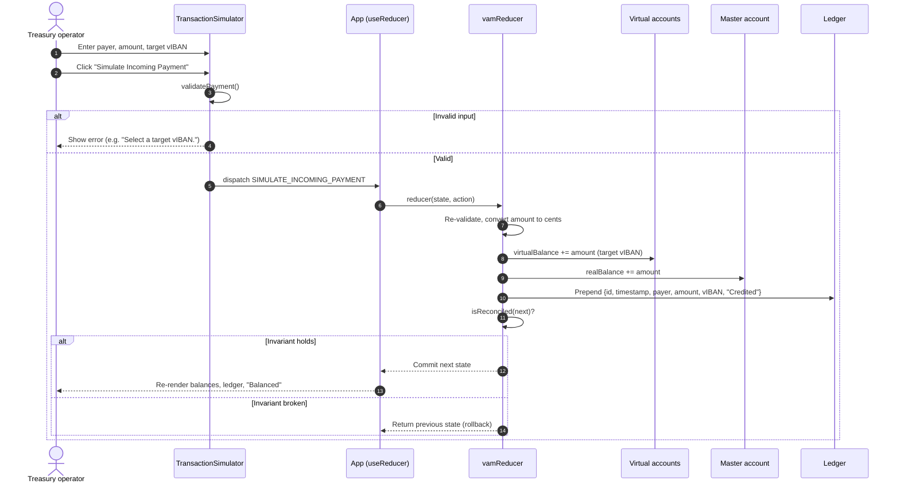
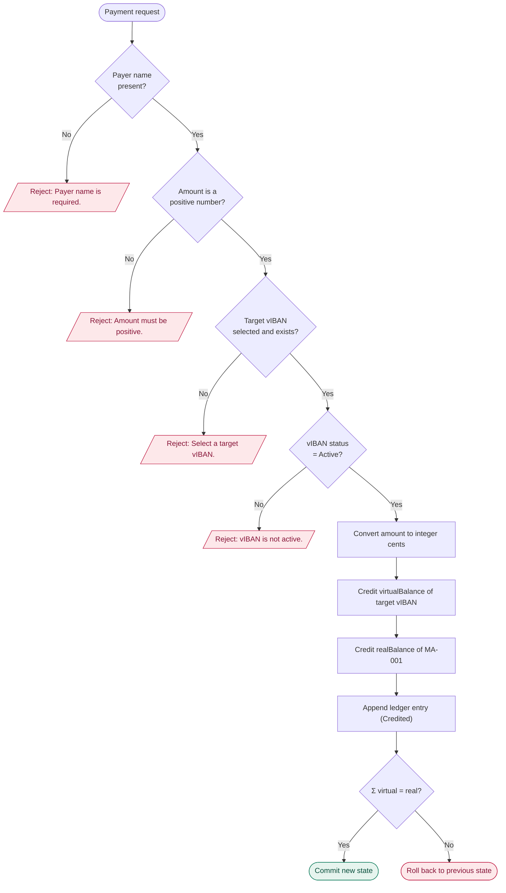
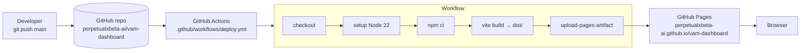
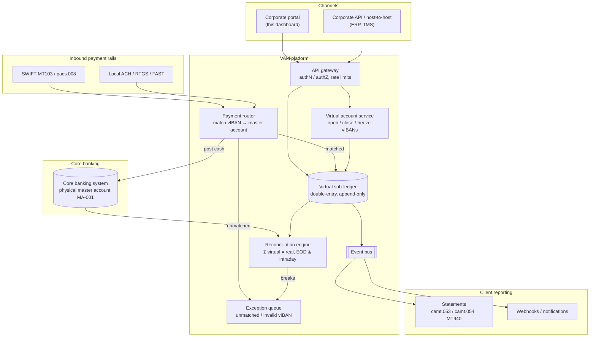

# Architecture

This document describes how the VAM prototype works today, and sketches how the same design would map onto a production banking platform. Diagrams are written in [Mermaid](https://mermaid.js.org/) so GitHub renders them inline and they can be edited as text.

1. [Business concept: master account and vIBANs](#1-business-concept-master-account-and-vibans)
2. [Application components](#2-application-components)
3. [Data model](#3-data-model)
4. [Payment routing sequence](#4-payment-routing-sequence)
5. [Validation and posting logic](#5-validation-and-posting-logic)
6. [Build and deployment](#6-build-and-deployment)
7. [Target-state production architecture (illustrative)](#7-target-state-production-architecture-illustrative)

---

## 1. Business concept: master account and vIBANs

A corporate client holds **one physical account** at the bank. Each business unit, property or customer gets its own **virtual account number (vIBAN)**. Payers wire money to the vIBAN; cash physically lands in the master account, while a virtual sub-ledger records which vIBAN it belongs to.

**Core invariant:** `Σ virtualBalance (all vIBANs) = realBalance (MA-001)`. The app checks this on every posting and shows it in the header as the reconciliation indicator.

---

## 2. Application components

A single-page React app. All state lives in one `useReducer` store; UI components read from it and send actions to it. There is no backend: the reducer stands in for the database and the posting engine.

| Layer | File | Responsibility |
|---|---|---|
| UI | `src/App.jsx` | Rendering, form input, dispatching actions |
| State / domain | `src/state/vamStore.js` | Mock database, validation, atomic posting, reconciliation guard |
| Styling | `tailwind.config.js`, `src/index.css` | Corporate navy / slate palette, card shadows |

---

## 3. Data model

Money is stored as **integer cents** to keep the invariant exact (no floating-point drift).

---

## 4. Payment routing sequence

What happens when the operator clicks **Simulate Incoming Payment**.

Steps 6 to 9 happen inside one reducer call, so React never renders a state where only one side was credited.

---

## 5. Validation and posting logic

---

## 6. Build and deployment

---

## 7. Target-state production architecture (illustrative)

The prototype puts the whole posting engine in the browser. A production VAM service would move each responsibility behind a server boundary. This diagram is a reference design for discussion, not something built in this repo.

| Prototype (today) | Production equivalent |
|---|---|
| `initialState` in memory | Virtual sub-ledger database + core banking system |
| `vamReducer` atomic update | Database transaction / double-entry posting with idempotency keys |
| `isReconciled()` guard | Reconciliation engine (intraday and end-of-day) with break alerts |
| `validatePayment()` | Payment router checks (vIBAN exists, active, currency match, sanctions screening) |
| Rejected entries in ledger | Exception / repair queue for unmatched payments |
| Transaction list | camt.053 / camt.054 / MT940 statements and webhooks |
